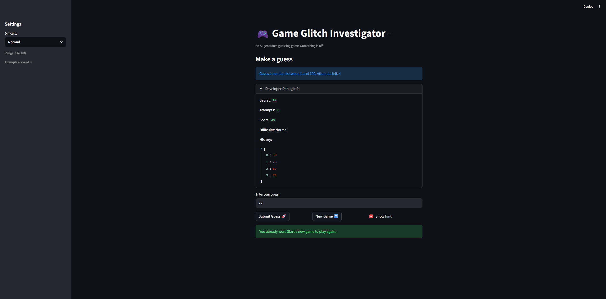
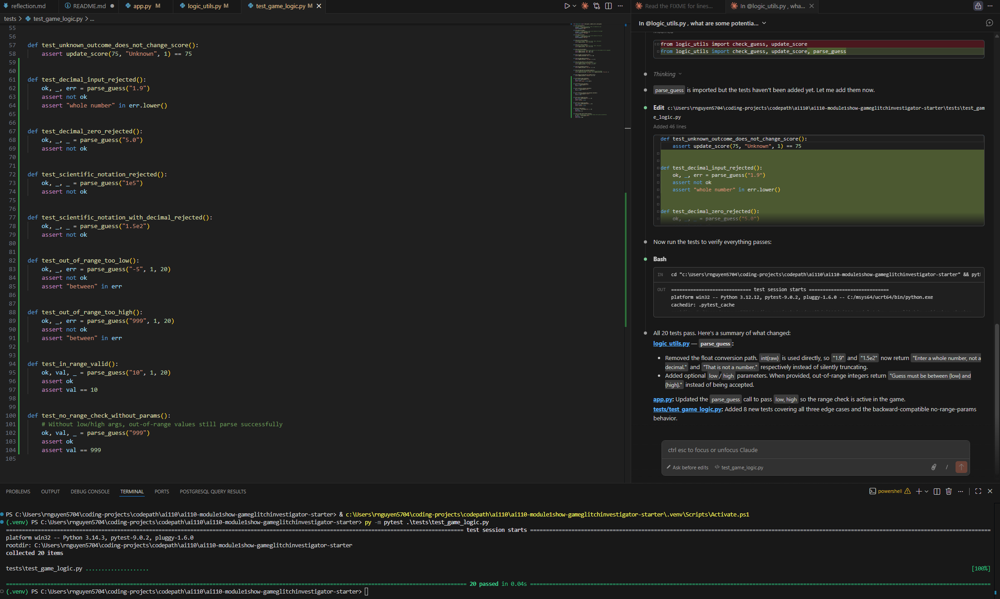

# 🎮 Game Glitch Investigator: The Impossible Guesser

## 🚨 The Situation

You asked an AI to build a simple "Number Guessing Game" using Streamlit.
It wrote the code, ran away, and now the game is unplayable. 

- You can't win.
- The hints lie to you.
- The secret number seems to have commitment issues.

## 🛠️ Setup

1. Install dependencies: `pip install -r requirements.txt`
2. Run the broken app: `python -m streamlit run app.py`

## 🕵️‍♂️ Your Mission

1. **Play the game.** Open the "Developer Debug Info" tab in the app to see the secret number. Try to win.
2. **Find the State Bug.** Why does the secret number change every time you click "Submit"? Ask ChatGPT: *"How do I keep a variable from resetting in Streamlit when I click a button?"*
3. **Fix the Logic.** The hints ("Higher/Lower") are wrong. Fix them.
4. **Refactor & Test.** - Move the logic into `logic_utils.py`.
   - Run `pytest` in your terminal.
   - Keep fixing until all tests pass!

## 📝 Document Your Experience

- [ ] Describe the game's purpose.

The game is a simple guessing game that gives players hint on the secret number. The player has a limited number of guesses and gets a higher or lower score depending on how many guesses they have remaining after they guess the secret number. If they run out of guesses, they lose.

- [ ] Detail which bugs you found.

Some bugs that I found is that the hint that the player gets for an incorrect guess lead the player in the wrong direction. For example, if the player guessed lower than the secret number, the program would incorrectly tell the player to guess lower. Another bug that I found is that the "New Game" button does not correctly start a new game, as the player cannot input any guesses.

- [ ] Explain what fixes you applied.

Some fixes that I have applied are fixing the hint messages to correctly display whether to guess higher/lower depending on the guess and secret number, as well as fixing the "New Game" button to actually restart the game and allow the player to input guesses again.

## 📸 Demo

- [ ] [Insert a screenshot of your fixed, winning game here]

- [ ] [Insert a screenshot of pytest being ran with tests passing for Challenge 1 here]

## 🚀 Stretch Features

- [ ] [If you choose to complete Challenge 4, insert a screenshot of your Enhanced Game UI here]
